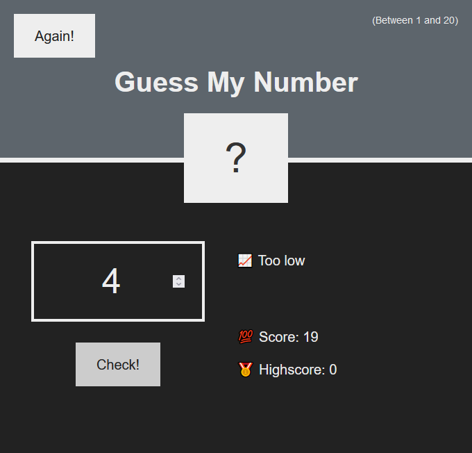

# 🛠 JS version - guess number game

# 🔗 [Live Preview](https://main--bright-puppy-93dba7.netlify.app/)

## Welcome! 👋

- This was an older Javascript exercise project, here you can see more modern React version (https://github.com/Predrag-Jandric/React-guess-number-game) where you guess a secret number between 1 and 20. The game helped me practice JS logic.

---

- You enter a number, and the game tells you if it's too high or too low.

- The game keeps track of how many times you try to guess. You start with a score of 30 and it goes down each time you guess wrong.

- There's a highscore too! It shows your best score, so you can try to beat it.

---

### Languages and features 👨‍💻 

- JS: functions, if statements.

Thanks for checking out my projects.